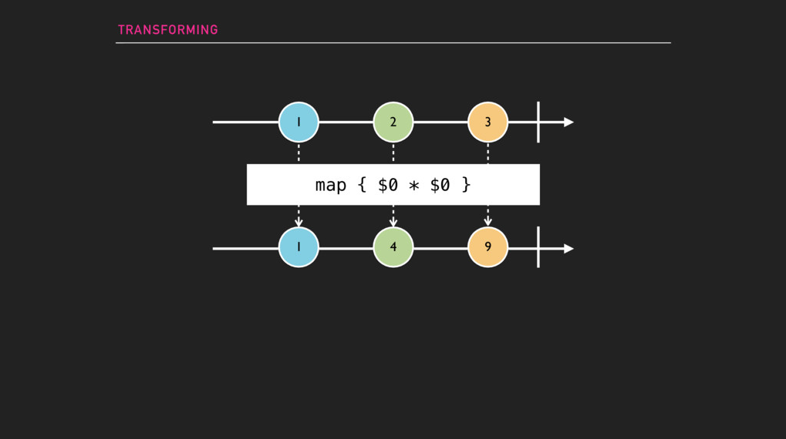
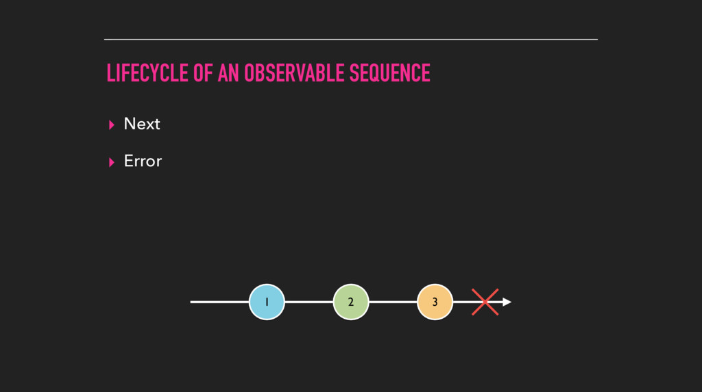

# 使用 RxSwift 进行响应式编程

您或许曾经听说过「响应式编程」(Reactive Programming) 一词，甚至很可能研究过 RxSwift 的相关内容。但是如果您没有在日常开发中使用响应式编程的话，那么您就真的落后于时代了！在 AltConf 2016 的本次讲演中，Scott Gardner 将带大家走入到响应式编程的世界当中，并告诉大家一个简单的方法来开始学习 Reactive Swift。他会对 RxSwift 进行一个大致的介绍，同时还会介绍其他的学习资料来帮助您更好的学习 RxSwift。快来看一看使用 RxSwift 进行响应式编程是如何改变您的编码方式，这将超乎您的想象。

译者注：国内最好的 RxSwift 教程推荐 靛青DKQing 所撰写的 RxSwift 教程系列 ，有兴趣的同学可以前往阅读（温馨提示，需要自带梯子）。

我很高兴今天能在这里介绍响应式编程，尤其是关于 RxSwift 的内容。在我开始之前，请准许我向诸位介绍一下我自己。

我的名字是 Scott Gardner，我已经有 6 年的 iOS 开发经验了，对于 Swift 来说是 2 年。我写的其中一本关于 Swift 的书是关于如何帮助 Objective-C 开发者迁移到 Swift 的。我写过也教过很多教程，我在 CocoaConf 以及其他会议上演示过 Swift 和 iOS 的相关内容，在 St. Louis 的华盛顿大学也做过讲演，我还为 Ray Wenderlich 撰写过文章，现在我是 Lynda.com 的一名签约作家 。我同时也是 RxSwift 项目的贡献者之一，并且就如 Alex 所说，我会在本月晚些时候去 The Weather Channel 就职，这是隶属于 IBM 的一家公司，我将成为他们那儿的 iOS 工程团队的管理者。

今天的这次讲演，将是关于如何使用一个名为 RxSwift 的响应式第三方库的，它会为您完成诸多地繁重工作，从而让编程更加轻松。

传统式与响应式大对比

我觉得我应该需要用一个例子，来向各位直观地展示一下 RxSwift 能够做些什么。

我们这里要大致说明一下这个例子，这是一个 iOS 应用，我将创建一个 Speaker 的结构体，这只是一个存储讲演者名字、Twitter 和头像的简单数据结构，此外它还遵循 CustomStringConvertible 协议。

```swift
import UIKit

struct Speaker {
    let name: String
    let twitterHandle: String
    var image: UIImage?

    init(name: String, twitterHandle: String) {
        self.name = name
        self.twitterHandle = twitterHandle
        image = UIImage(named: name.stringByReplacingOccurrencesOfString(" ", withString: ""))
    }
}

extension Speaker: CustomStringConvertible {
    var description: String {
        return"\(name) \(twitterHandle)"
    }
}
```

接下来，我们要写一个 ViewModel 。

```swift
import Foundation

struct SpeakerListViewModel {
    let data = [
        Speaker(name: "Ben Sandofsky", twitterHandle: "@sandofsky"),
        Speaker(name: "Carla White", twitterHandle: "@carlawhite"),
        Speaker(name: "Jaimee Newberry", twitterHandle: "@jaimeejaimee"),
        Speaker(name: "Natasha Murashev", twitterHandle: "@natashatherobot"),
        Speaker(name: "Robi Ganguly", twitterHandle: "@rganguly"),
        Speaker(name: "Virginia Roberts",  twitterHandle: "@askvirginia"),
        Speaker(name: "Scott Gardner", twitterHandle: "@scotteg")
    ]
}
```

不过我不想让本次讲演变成了关于 MVVM 或者其他诸如此类的架构模式的讲演，因此我不会着重介绍这一部分。我在这里所做的就是创建了一个会被 UITableView 所使用的数据源而已，并且我将它提取出来，让其作为一个能够创建数据的单独数据类型。接下来，我们会在持有 UITableView 的视图控制器当中使用这个类型，因此这只是对代码做了一点小小的变化而已。接下来在视图控制器当中，我将要实现标准的 UITableViewDataSource 和 UITableViewDelegate 协议，就如同我们以往所做的那样。这些代码完完全全就是样板代码 (boilerplate code)，我们大家都已经一遍又一遍地写过这些代码了。我们最终的效果就是一个 UITableView ，它列出了部分本周在这里进行讲演的演讲者信息。

```swift
class SpeakerListViewController: UIViewController {

    @IBOutlet weak var speakerListTableView: UITableView!

    let speakerListViewModel = SpeakerListViewModel()

    override func viewDidLoad() {
        super.viewDidLoad()
        speakerListTableView.dataSource = self
        speakerListTableView.delegate = self
    }
}

extension SpeakerListViewController: UITableViewDataSource {

    func tableView(tableView: UITableView, numberOfRowsInSection section: Int)-> Int {
        return speakerListViewModel.data.count
    }

    func tableView(tableView: UITableView, cellForRowAtIndexPath indexPath: NSIndexPath) -> UITableViewCell {
        guard let cell = tableView.dequeueReusableCellWithIdentifier("SpeakerCell")
            else {
                return UITableViewCell()
        }

        let speaker = speakerListViewModel.data[indexPath.row]
        cell.textLabel?.text = speaker.name
        cell.detailTextLabel?.text = speaker.twitterHandle
        cell.imageView?.image = speaker.image
        return cell
    }
}

extension SpeakerListViewController: UITableViewDelegate {
    func tableView(tableView: UITableView, didSelectRowAtIndexPath indexPath: NSIndexPath) {
        print("You selected \(speakerListViewModel.data[indexPath.row])")
    }
}
```

好的，现在我将把这个项目 Rx 化，首先第一步我要做的就是修改 ViewModel ，将 data 属性变成一个可观察序列对象 (Observable Sqquence)。接下来我会好好解释一下这个「可观察序列对象」是什么的，但是现在各位只要知道，这个序列对象当中的内容和我们之前在数组当中所包含的内容是完全一模一样的。「序列」可以对这些数值进行「订阅」(Subscribe)，就如同 NSNotificaitonCenter 的概念差不多。

```swift
import RxSwift

struct SpeakerListViewModel {
    let data = Observable.just([
        Speaker(name: "Ben Sandofsky", twitterHandle: "@sandofsky"),
        Speaker(name: "Carla White", twitterHandle: "@carlawhite"),
        Speaker(name: "Jaimee Newberry", twitterHandle: "@jaimeejaimee"),
        Speaker(name: "Natasha Murashev", twitterHandle: "@natashatherobot"),
        Speaker(name: "Robi Ganguly", twitterHandle: "@rganguly"),
        Speaker(name: "Virginia Roberts",  twitterHandle: "@askvirginia"),
        Speaker(name: "Scott Gardner", twitterHandle: "@scotteg")
    ])
}
```

因此，我们回到视图控制器当中，我们现在就不用去实现数据源和委托协议了，这里我写了一些响应式代码，它们将数据和 UITableView 建立了绑定关系。

```swift
import RxSwift
import RxCocoa

class SpeakerListViewController: UIViewController {

    @IBOutlet weak var speakerListTableView: UITableView!

    let speakerListViewModel = SpeakerListViewModel()
    let disposeBag = DisposeBag()

    override func viewDidLoad() {
        super.viewDidLoad()
        speakerListViewModel.data
.bindTo(speakerListTableView.rx_itemsWithCellIdentifier("SpeakerCell")) { _, speaker, cell in
                cell.textLabel?.text = speaker.name
                cell.detailTextLabel?.text = speaker.twitterHandle
                cell.imageView?.image = speaker.image
            }
.addDisposableTo(disposeBag)

        speakerListTableView.rx_modelSelected(Speaker)
.subsribeNext { speaker in
                print("You selected \(speaker)")
        }
.addDisposableTo(disposeBag)
    }
}
```

我现在会对这段代码逐行进行解释。

我添加了一个名为 DisposeBag 的玩意儿，这是 Rx 在视图控制器或者其持有者将要销毁的时候，其中一种实现「订阅处置机制」的方式。这就和 NSNotificationCenter 的 removeObserver 类似。

因此，「订阅」将在对象销毁的时候进行处置，它会负责清空它里面的资源。接下来我们使用了 rx_itemsWithCellIdentifier ，这是 Rx 基于 cellForRowAtIndexPath 数据源方法的一个封装。此外，Rx 也完成了对 numberOfRowsAtIndexPath 方法的实现，这个方法在传统方式当中是必不可少的，但是这里我们就没必要实现它了，Rx 已经帮我们完成了。

接下来是这个 rx_modelSelected ，它是 Rx 基于 UITableView 委托回调方法 didSelectRowAtIndexPath 的一个封装。

好的，这就是全部了。然后来对比一下传统方式和响应式的异同吧！

实际上，您会发现您已经精简了将近 40% 的代码量，而这些所精简的代码基本上就是我们之前所说的那些「样板代码」。如果我们换个角度比喻的话，这就像我们只需要工作到午餐后，但是却能够拿一天的薪水。或者，对于我们这些在美国工作的人来说，就相当于工作到 7 月 4 号，然后剩下的日子就可以去享受带薪假期了。

是不是感觉很心动呢？

这只不过是一个很简单的例子而已，但是我们所说的绝对不只是为了精简代码而已。我们所要做的，就是要编写更具有表现力的代码，尤其是在编写异步代码的时候。

那么现在各位可能就会在想了，何为响应式编程？

响应式编程的关键在于：将异步可观察序列对象模型化。这些序列对象可以包含值，就如同我在上一个例子中给大家展示的那样，但是这些序列对象同时也可以是所谓的「事件流」，比如说单击或者其他手势事件。其他所有东西都是建立在这个概念的基础上的。因此，响应式编程的概念已经存在了 20 年了，但是直到近年它才有了极大的发展，比如说 2009 年所引入的响应式扩展 (Reactive Extension)。

因此，RxSwift 是一系列标准操作符的集合，这些操作符涵盖了所有的 Rx 实现，它可以被用来创建并与可观察序列对象协同工作。

当然，我们还有专门面向平台的第三方库，比如说我在上个例子为大家展示的 RxCocoa ，它是专门为 iOS、OS X 之类平台所构建的。RxSwift 是针对 Swift 响应式扩展的官方实现，每个实现方法都实现了在不同语言和不同技术平台上相同的模式和操作符。

在 Rx 中，基本上所有东西要么是一个可观察序列对象，要么就是需要和可观察序列对象进行协同工作的。因此，序列对象将会按需推出其中的内容，这些内容都属于技术事件。您可以订阅一个可观察序列，以便对推出的这些事件作出响应。再强调一遍，这个机制和 NSNotificationCenter 极其类似，但是 Rx 更加优秀。
RxSwift操作符将执行各种任务，它们是基于事件的。它们通常以异步方式执行，此外 Rx 还是函数式的，因此您或许会采用函数式响应式编程 (Functional Reactive Programming, FRP) 模式，我对这个模式是很满意的，我觉得这是 RxSwift 应有的样子。其他的话我就可能不这么看了。

也就是说，Rx 实现了两种常见的模式：

首先是观察者模式 (Observer)，它是管理一系列其从属单元 (Dependents) 的对象，其中包括了观察者和订阅者 (Subscriber)，一旦发生变化就会发送通知。

此外是迭代模式 (Iterator)，这样集合或者序列中的值就可以进行遍历了。

因此，Rx 对于绝大多数现代编程语言来说都是可以实现的。因此，让我们现在来谈论一下某个可观察序列对象的生命周期吧！

可观察序列对象的生命周期

这个箭头表示可观察序列对象随时间变化的情况，当某个值或者一系列值被放到序列对象当中的时候，它就会给它的观察者发送一个「下一步 (Next)」事件，而这个事件当中将会包含这些新增的元素。再次强调一遍，这个过程称之为发送 (Emitting)，而那些值将变成元素 (Element)。不管这里的这些值是什么，比如说触摸事件、点击事件、TouchInside 事件还是什么，它们的工作方式都是相同的。（顺便提一点，这被称之为 Marble 图。）

如果遇到了错误，那么序列对象将会发送一个错误事件 (Error Event)，这其中将包含有错误类型实例，这样您就可以对这个事件做出回应，以便执行错误处理，问询该错误，以便查看哪里出了问题。当错误发生之后，也就是这条时间线上的 X 表示的地方，它同样会立刻终止这个序列，当序列中止之后，它就没办法再发送更多的事件了，因此一旦您接取到了错误事件，就意味着这个序列已经死掉了。



序列也可以正常终止，而当序列正常终止之后，它将会发送一个完成事件 (Completed Event)，也就是时间线上的竖线表示的地方。

好的，这部分说完了。

也就是说，我在这儿说了很多关于 RxSwift 的内容，不过讲道理，当我在谈论 RxSwift 的时候，我实际上是指一个更大的功能集，不仅仅包含了 RxSwift 核心库，还包含了 RxCocoa（这是专门为 iOS、OS X、watchOS 和 tvOS 平台而专门实现的响应式扩展）。目前为止，RxSwift 社区仓库当中已经有很多可用的响应式第三方库了。比如说有 RxDataSources 库。它借助响应式扩展来为 UITableView 和 UICollectionView 提供了多种更友善的使用方式。

如果您想要跟随我来一起浏览 RxSwift 的话，您可以根据以下说明，去获取 CocoaPods Playgrounds 插件，这可以创建一个特殊的 Playground，它可以将诸如 RxSwift 之类的第三方库拉取到其中。

1. 安装 ThisCouldBeUsButYouPlaying

bit.ly/podsPlaygrounds
gem install cocoapods-playgrounds

2. 创建 RxSwiftPlayground
pod playgrounds RxSwift

我首先做的事情就是创建一个封装我的示例的辅助函数。它会将描述信息打印出来，然后运行示例代码。

```swift
//Please build the scheme 'RxSwiftPlayground' first
import XCPlayground
XCPlaygroundPage.currentPage.needsIndefiniteExecution = true

import RxSwift

func exampleOf(description: String, action: Void -> Void) {
   print("\n--- Example of:", description, "---")
   action()
}
```

非常简单，对吧？

我们的第一个例子将要来使用 just 操作符，我们将创建一个包含单个值的可观察序列，在这个例子中将是一个整数值。接下来，我会订阅一个事件，这个事件随后将通过 subscribe 操作符从这个可观察序列当中传送出去。每当我接收到事件对象，我都会将其输出到控制台上，这里我使用 $0 这个默认参数名。

```swift
exampleOf("just") {
   Observable.just(32)
.subscribe {
        print($0)
   }
}
```

也就是说，首先我们可以获取包含该元素的「下一步事件」，接着我们就可以获取「完成事件」。和错误事件类似，一旦某个可观察序列发送了完成事件，那么这个序列将自动终止。它将无法再次发送任何元素。

```swift
exampleOf("just") {
_ = Observable.just(32)
.subscribeNext {
     print($0)
   }
}
```

如果您对 Swift 不熟悉的话，只需要知道， $0 是一个默认参数。只要我想，我就可以像这样显式地命名出来，但是如果闭包中只有一两个参数的话，那么我更倾向于使用诸如 $0 、 $1 之类的默认参数名。这种命名方式更简单、更方便。

如果您这个时候观察到 Playground 向您报了一个警告，那是因为订阅实际上会返回一个表示该订阅对象的值，这是一个 Disposable 的类型，但是我们现在还没有对其进行任何处理。

```swift
exampleOf("just") {
    Observable.just(32)
.subscribe { element in
       print(element)
    }
}
```

首先我将要小小地修改一下这个例子，只需要指明忽略此值即可。接下来要注意到，这个时候我将换用 subscribeNext 操作符。 subscribeNext 只会监听下一个事件，并且它返回的只是元素，而不是包含元素的事件。因此，我们现在只需要输出这个元素即可。

```swift
exampleOf("just") {
_ = Observable.just(32)
.subscribeNext {
        print($0)
    }
}
```

从多个值中建立可观察序列

接下来我将要看一看如何从多个值中建立可观察序列。而这个 of 操作符则可以获取多个值。我对其进行订阅，然后向以往一样将其输出，只有这时我能够对这个订阅对象进行处理 (dispose)，而不是指明忽略其返回值，处理可以取消这个订阅对象。因此，现在我们可以从这个可观察序列当中输出每个元素的值了。

```swift
import Foundation

struct SpeakerListViewModel {
    let data = [
        Speaker(name: "Ben Sandofsky", twitterHandle: "@sandofsky"),
        Speaker(name: "Carla White", twitterHandle: "@carlawhite"),
        Speaker(name: "Jaimee Newberry", twitterHandle: "@jaimeejaimee"),
        Speaker(name: "Natasha Murashev", twitterHandle: "@natashatherobot"),
        Speaker(name: "Robi Ganguly", twitterHandle: "@rganguly"),
        Speaker(name: "Virginia Roberts",  twitterHandle: "@askvirginia"),
        Speaker(name: "Scott Gardner", twitterHandle: "@scotteg")
    ]
}
```

我们同样可以从数组中创建可观察序列。 toObservable 可以将数组转换为可观察序列。

因此首先，我们要创建一个 DisposeBag ，要记住这玩意可以在销毁的时候处理其中的内容，接下来我会使用 toObserbable 来将一组整数数组转换为可观察序列，接下来我会使用 subscribeNext 并将元素值输出。最后我将这个订阅对象添加到 DisposeBag 中。

```swift
import Foundation

struct SpeakerListViewModel {
    let data = [
        Speaker(name: "Ben Sandofsky", twitterHandle: "@sandofsky"),
        Speaker(name: "Carla White", twitterHandle: "@carlawhite"),
        Speaker(name: "Jaimee Newberry", twitterHandle: "@jaimeejaimee"),
        Speaker(name: "Natasha Murashev", twitterHandle: "@natashatherobot"),
        Speaker(name: "Robi Ganguly", twitterHandle: "@rganguly"),
        Speaker(name: "Virginia Roberts",  twitterHandle: "@askvirginia"),
        Speaker(name: "Scott Gardner", twitterHandle: "@scotteg")
    ]
}
```

相当简单。

通常情况下，您会希望创建一个可以添加新元素的可观察序列，然后让订阅对象能够接收包含这些新添加值的下一步事件，这个操作通常会贯穿整个应用周期，并且以异步方式进行。 BehaviorSubject 正好可以做到这一点。您可以认为 BehaviorSubject 只是简单地代表了一个随时间推移而发生更新或更改的值。

我需要向大家解释一下为什么这种情况不能只维持很短一段时间，但首先，我会在这里创建一个 String 类型的 BehaviorSubject ，初始值为 “Hello”。接下来我会对其进行订阅，从而让它能够接收更新，并将更新值输出出来。注意到这里我就没有使用 subscribeNext 了。之后您就知道为什么这么做了。接下来我向这个 BehaviorSubject 中添加一个新的值： “World”。

```swift
import Foundation

struct SpeakerListViewModel {
    let data = [
        Speaker(name: "Ben Sandofsky", twitterHandle: "@sandofsky"),
        Speaker(name: "Carla White", twitterHandle: "@carlawhite"),
        Speaker(name: "Jaimee Newberry", twitterHandle: "@jaimeejaimee"),
        Speaker(name: "Natasha Murashev", twitterHandle: "@natashatherobot"),
        Speaker(name: "Robi Ganguly", twitterHandle: "@rganguly"),
        Speaker(name: "Virginia Roberts",  twitterHandle: "@askvirginia"),
        Speaker(name: "Scott Gardner", twitterHandle: "@scotteg")
    ]
}
```

正如我之前所说， BehaviorSubject 表示了能够随时变化的值，但是实际上我并不会对这个值进行修改。因为它仍然是不可修改的。我所做的就是使用 on 操作符来向这个序列当中添加 “World!” 这个词，里面使用了一个 .Next 枚举值来封装要添加的新值。这接下来会使得序列发送一个下一步事件给观察者。也就是说，这个 on 操作符和 .Next 枚举值是用来向序列中放入新值的最初级版本，当然我们还有更便利的操作符 onNext ，这也是我更倾向于使用的一个。它所做的事情和前一个例子完全一样，但是它写起来更容易，并且阅读起来也更容易。

其结果是：我看到两个下一步事件中的元素都被打印出来了，其中包括了初始值的元素，因为在订阅创建之前，这个相应的值就被赋值了。其原因是 BehaviorSubject 在新的订阅者订阅之后，会总是发送最初始或者最新的元素。虽然当 BehaviorSubject 即将被销毁处理的时候不会自动发送完成事件，但是它同样还会发送错误事件并且终止监听。我们很有可能不希望使用这个特性。通常情况下，您会希望在订阅被销毁的时候，自动实现完成事件的发送，此外还要组织错误事件的发生，尤其是我们在谈论 UI 继承这方面事情的时候，这个问题会更为严峻。

因此，作为替代，您可以使用名为 Variable 的类型。 Variable 是基于 BehaviorSubject 封装的。它通过 asObserbable 操作符来暴露其 BehaviorSubject 的可观察序列。有一些事是 Variable 所做的而 BehiviorSubject 所不能完成的，那就是 Variable 保证不会发生任错误事件，并且当它即将被销毁处理的时候，它就会自动发送一个完成事件。因此，我们使用 Variable 的 value 属性来获取当前值，亦或者向序列中设置一个新的值。比起之前的 onNext 来说，我更喜欢这个语法，因此我更倾向于使用 Variable 。至于其他原因再次就暂时不表了。

```swift
import Foundation

struct SpeakerListViewModel {
    let data = [
        Speaker(name: "Ben Sandofsky", twitterHandle: "@sandofsky"),
        Speaker(name: "Carla White", twitterHandle: "@carlawhite"),
        Speaker(name: "Jaimee Newberry", twitterHandle: "@jaimeejaimee"),
        Speaker(name: "Natasha Murashev", twitterHandle: "@natashatherobot"),
        Speaker(name: "Robi Ganguly", twitterHandle: "@rganguly"),
        Speaker(name: "Virginia Roberts",  twitterHandle: "@askvirginia"),
        Speaker(name: "Scott Gardner", twitterHandle: "@scotteg")
    ]
}
```

这些就是 RxSwift 中响应式编程的基础构建模块了，除此之外还有其他更多的类型，当然还有更多操作符。我随后可能会涉及其中的一些。但是一旦您了解了其中的基础内容，其他的一切都是小问题了。我觉得理解剩下的内容不会太难。再次强调一下，您只需要记住一点：无事不序列。我们不应该对值本身进行更改。您应该向序列中添加新值，接下来观察者便可以响应这些值，因为这些值已经由可观察序列发送给了观察者。

现在我已经向各位介绍了几种创建可观察序列的方法，现在我将讲述几种变换可观察序列的方法。

所以大家都对 Swift 的 map 方法有所了解了，对吗？

您可以创建一个数组，然后你可以调用数组的 map 方法，然后使用一个闭包以向其提供执行相关变换的操作，随后，这会返回一个数组，这个数组中包含了所有已经完成变换的元素。Rx 拥有自己的 map 操作符，这和传统的 map 操作符是非常相似的。

在这里，我会使用 of 操作符来创建一个包含整数的可观察序列。接着，我使用 map 操作符来将这个序列进行变换，使得其中的每个元素都乘以它们自身，随后我使用 subscribeNext 来输出每个元素的值。

```swift
import Foundation

struct SpeakerListViewModel {
    let data = [
        Speaker(name: "Ben Sandofsky", twitterHandle: "@sandofsky"),
        Speaker(name: "Carla White", twitterHandle: "@carlawhite"),
        Speaker(name: "Jaimee Newberry", twitterHandle: "@jaimeejaimee"),
        Speaker(name: "Natasha Murashev", twitterHandle: "@natashatherobot"),
        Speaker(name: "Robi Ganguly", twitterHandle: "@rganguly"),
        Speaker(name: "Virginia Roberts",  twitterHandle: "@askvirginia"),
        Speaker(name: "Scott Gardner", twitterHandle: "@scotteg")
    ]
}
```

这就是 map 的用法了。

在 Marble 图中，它是这么表示的：



Map会变换每一个从源可观察序列 (Source Observable Sequence) 发射出去的元素。那么，如果一个可观察序列当中包含有您想要进行监听的可观察序列属性的话，并且你还需要订阅这个序列的话，这个时候会发生什么呢？注意我们的关键点：可观察序列当中包含了可观察序列属性。

这时，我们只需更换下思路，你会发现前方豁然开朗。RxSwift 的 flatMap 可以解决这一点，它与 Swift 标准的 flatMap 方法及其相似，不过不同的是，RxSwift 的 flatMap 只能用于可观察序列集，并且它是以异步的方式进行的，它会将包含包含可观察序列集的一个可观察序列重组为一个单独的序列。 flatMap 同样也会对从可观察序列当中发送出来的元素执行相应的变换操作。

原文 “Down the rabbit hole”，语出爱丽丝梦游仙境，表示「进入了仙境、进入了另一片天地」，就如同「桃花源记」的「世外桃源」。

因此，我在这里要一步一步地来讲解这个例子：

首先，我们这里创建了一个 Person 接哦古提，它包含了一个类型为 Variable 的 name 变量，因此， name 当中包含了一个可观察序列，但是由于我将其声明成了一个变量，因此我们不仅仅能够向这个序列上增加值，而且这个序列本身还可以重新赋值。

```swift
import Foundation

struct SpeakerListViewModel {
    let data = [
        Speaker(name: "Ben Sandofsky", twitterHandle: "@sandofsky"),
        Speaker(name: "Carla White", twitterHandle: "@carlawhite"),
        Speaker(name: "Jaimee Newberry", twitterHandle: "@jaimeejaimee"),
        Speaker(name: "Natasha Murashev", twitterHandle: "@natashatherobot"),
        Speaker(name: "Robi Ganguly", twitterHandle: "@rganguly"),
        Speaker(name: "Virginia Roberts",  twitterHandle: "@askvirginia"),
        Speaker(name: "Scott Gardner", twitterHandle: "@scotteg")
    ]
}
```

这只是一个虚构的里子，只是为了向您展示这里面的工作原理。

这里我创建了几个 Person 的实例，Scott 和 Lori。接下来，我会将 Person 可观察化 (as observable) 后，然后使用 flatMap 来访问其 name 可观察序列，之后将新的值输出，

记住对于 Variable 来说，我们需要使用 asObservable 来访问其底层的可观察序列。因此，Person 当中的内容是 Scott 的，因此我们首先会得到输出 Scott 。但是之后我直接将 Person 的值重新赋值成了 Lori，因此之后我们会得到输出 Lori 。最后，我们向 Scott 的序列当中放入了一个新的值 Eric 。

因为我使用了 flatMap ，因此这两个序列实际上都仍处于活跃状态，因此这时候我们会看到 Eric 打印了出来。这是一个很棘手的问题。这往往会导致内存泄漏等问题发生，因此除非你觉得你必须要使用 flatMap ，否则的话请使用别的东西来替代它。所用的替代物也就是 flatMapLatest 。因此如果我在这里转而使用 flatMapLatest ，而不是使用 flatMap ，它的功能和 flatMap 基本一模一样，但是接下来它会将当前订阅切换为最后一个序列，因此它会忽略来自之前序列的发送值 (emission)。

```swift
import Foundation

struct SpeakerListViewModel {
    let data = [
        Speaker(name: "Ben Sandofsky", twitterHandle: "@sandofsky"),
        Speaker(name: "Carla White", twitterHandle: "@carlawhite"),
        Speaker(name: "Jaimee Newberry", twitterHandle: "@jaimeejaimee"),
        Speaker(name: "Natasha Murashev", twitterHandle: "@natashatherobot"),
        Speaker(name: "Robi Ganguly", twitterHandle: "@rganguly"),
        Speaker(name: "Virginia Roberts",  twitterHandle: "@askvirginia"),
        Speaker(name: "Scott Gardner", twitterHandle: "@scotteg")
    ]
}
```

也就是说，一旦我将 person.value 设为 Lori 之后，Scott 的发送值将会被忽略。

当我对 scott.name 进行设置的时候，Eric 将不再输出。因此，讲道理，我们有这个看起来像是同步操作的示例来向您展示了 flatMapLatest 的内部工作原理，但是这个操作符在诸如网络操作之类的异步使用情形当中使用更为频繁，之后我将会向大家简要地举一个例子说明一下。

RxSwift同样也引入了一系列非常好用的调试操作符。其中之一名为 debug 。你可以想下面这样，向一个链式步骤当中添加 debug 。

```swift
import Foundation

struct SpeakerListViewModel {
    let data = [
        Speaker(name: "Ben Sandofsky", twitterHandle: "@sandofsky"),
        Speaker(name: "Carla White", twitterHandle: "@carlawhite"),
        Speaker(name: "Jaimee Newberry", twitterHandle: "@jaimeejaimee"),
        Speaker(name: "Natasha Murashev", twitterHandle: "@natashatherobot"),
        Speaker(name: "Robi Ganguly", twitterHandle: "@rganguly"),
        Speaker(name: "Virginia Roberts",  twitterHandle: "@askvirginia"),
        Speaker(name: "Scott Gardner", twitterHandle: "@scotteg")
    ]
}
```

你可以选择是否向其中添加描述字符串，随后它会输出所接收到的每一个事件的详细信息。如果你初学 RxSwift，并且需要找出所有这些部件是如何工作的话，那么这个命令非常有用。

在 RxSwift 中还有很多的操作符。我在话题继续之前，我想要简要地介绍其中的一些，我会尽可能地给大家展示，之后我会给大家分享一些有用的资源，这样大家在回去之后，如果感兴趣的话可以再深入了解一下。

下面这个示例是关于如何使用 distinctUntilChanged ，这个操作符用来消除连续重复 (suppress consecutive duplicate)，也就是说如果某个值和上一个值相同，那么在新的序列当中，这个值将会被忽略。 searchString 初始只包含了值 iOS ，之后我会使用 map 方法将字符串变换为小写字符串，之后再使用 distinctUntilChanged 来进行过滤，如果新增加的值和上一个值相同的话，那么这个新增的值将被忽略。之后我们再对其进行订阅，输出其中的结果。

```swift
import Foundation

struct SpeakerListViewModel {
    let data = [
        Speaker(name: "Ben Sandofsky", twitterHandle: "@sandofsky"),
        Speaker(name: "Carla White", twitterHandle: "@carlawhite"),
        Speaker(name: "Jaimee Newberry", twitterHandle: "@jaimeejaimee"),
        Speaker(name: "Natasha Murashev", twitterHandle: "@natashatherobot"),
        Speaker(name: "Robi Ganguly", twitterHandle: "@rganguly"),
        Speaker(name: "Virginia Roberts",  twitterHandle: "@askvirginia"),
        Speaker(name: "Scott Gardner", twitterHandle: "@scotteg")
    ]
}
```

这个序列的初始值是 iOS，因此首先这个初始值会先被打印出来，之后，我们向序列中添加了同样的值。你会发现，即使大小写不同，但是只要其字母相同，由于我们使用了 distinctUntilChanged ，因此这个值仍然会被忽略掉。因此，之后我们向序列当中添加了新值 Rx，这个时候能够成功输出出来，之后我们又重新向序列添加 ios 这个值，而这个时候，ios 就被成功输出了，因为上一个值是 rx，而这俩并不相同。

有些时候，您可能想要同时观察多个序列。这个时候我们就可以使用这个 combineLatest 操作符了，它会将多个序列联合成一个单独的序列。您或许会想到，我们可以使用我几分钟之前向大家介绍的 flatMapLatest 操作符啊。事实上， flatMapLatest 是 map 和 combineLatest 两个操作符的联合，哦对了还有 switchLatest 操作符。

这里是另一个 Rx 项目类型，名为： PublishSubject ，它同 BehaviourSubject 非常相似，只是 PublishSubject 不需要初始值，并且它也不会将最后一个值重播给新的订阅者。这就是 PublishSubject 和 BehaviorSubject 的区别所在。

接下来我会使用 combineLatest ，它会等待在生成任何下一步事件之前，等待每一个源可观察序列完成元素的发送。但是一旦所有的源可观察序列都发送下一步事件之后，每当这些源可观察序列发送了新值， PublishSubject 都会立即发送下一步事件。因为我们只是刚刚完成了一轮循环，我们还没有将这些值放到数字序列上面来的，这个时候字符串序列当中也没有值。因此，这个时候订阅操作不会产生任何反应。

这个时候，只有 “Nothing yet” 这个信息会被输出出来。一旦我向字符串序列当中添加了新的值，这个时候字符串序列和数字序列当中的最新值就会被输出出来。随着值的新增，每当源序列发送了新的元素，这两个序列当中的最新元素都将会被输出出来。

```swift
import Foundation

struct SpeakerListViewModel {
    let data = [
        Speaker(name: "Ben Sandofsky", twitterHandle: "@sandofsky"),
        Speaker(name: "Carla White", twitterHandle: "@carlawhite"),
        Speaker(name: "Jaimee Newberry", twitterHandle: "@jaimeejaimee"),
        Speaker(name: "Natasha Murashev", twitterHandle: "@natashatherobot"),
        Speaker(name: "Robi Ganguly", twitterHandle: "@rganguly"),
        Speaker(name: "Virginia Roberts",  twitterHandle: "@askvirginia"),
        Speaker(name: "Scott Gardner", twitterHandle: "@scotteg")
    ]
}
```

下面是关于 takeWhile 的示例，只要满足了特定的条件，才会发送相应的元素。

首先，我将一个整数数组变为可观察序列，接下来我使用 takeWhile 来附加条件，只接收小于 5 的元素。一旦新的元素大于等于 5，那么序列将会终止并结束，然后发送一个完成消息。

```swift
class SpeakerListViewController: UIViewController {

    @IBOutlet weak var speakerListTableView: UITableView!

    let speakerListViewModel = SpeakerListViewModel()

    override func viewDidLoad() {
        super.viewDidLoad()
        speakerListTableView.dataSource = self
        speakerListTableView.delegate = self
    }
}

extension SpeakerListViewController: UITableViewDataSource {

    func tableView(tableView: UITableView, numberOfRowsInSection section: Int)-> Int {
        return speakerListViewModel.data.count
    }

    func tableView(tableView: UITableView, cellForRowAtIndexPath indexPath: NSIndexPath) -> UITableViewCell {
        guard let cell = tableView.dequeueReusableCellWithIdentifier("SpeakerCell")
            else {
                return UITableViewCell()
        }

        let speaker = speakerListViewModel.data[indexPath.row]
        cell.textLabel?.text = speaker.name
        cell.detailTextLabel?.text = speaker.twitterHandle
        cell.imageView?.image = speaker.image
        return cell
    }
}

extension SpeakerListViewController: UITableViewDelegate {
    func tableView(tableView: UITableView, didSelectRowAtIndexPath indexPath: NSIndexPath) {
        print("You selected \(speakerListViewModel.data[indexPath.row])")
    }
}
```

RxSwift同样也有 reduce 操作符，它和 Swift 当中的 reduce 方法一样，不过有些时候您可能想要对 reduce 过程当中的过程值进行操作，为此，你可以使用 RxSwift 的 scan 操作符。

```swift
class SpeakerListViewController: UIViewController {

    @IBOutlet weak var speakerListTableView: UITableView!

    let speakerListViewModel = SpeakerListViewModel()

    override func viewDidLoad() {
        super.viewDidLoad()
        speakerListTableView.dataSource = self
        speakerListTableView.delegate = self
    }
}

extension SpeakerListViewController: UITableViewDataSource {

    func tableView(tableView: UITableView, numberOfRowsInSection section: Int)-> Int {
        return speakerListViewModel.data.count
    }

    func tableView(tableView: UITableView, cellForRowAtIndexPath indexPath: NSIndexPath) -> UITableViewCell {
        guard let cell = tableView.dequeueReusableCellWithIdentifier("SpeakerCell")
            else {
                return UITableViewCell()
        }

        let speaker = speakerListViewModel.data[indexPath.row]
        cell.textLabel?.text = speaker.name
        cell.detailTextLabel?.text = speaker.twitterHandle
        cell.imageView?.image = speaker.image
        return cell
    }
}

extension SpeakerListViewController: UITableViewDelegate {
    func tableView(tableView: UITableView, didSelectRowAtIndexPath indexPath: NSIndexPath) {
        print("You selected \(speakerListViewModel.data[indexPath.row])")
    }
}
```

因此， scan 操作符将会累积一序列值，从初始值开始，然后返回每一个过程值 (Intermediate Value)。和 reduce 操作符类似， scan 可以接收一个标准数学运算符，比如说 + 等等，或者您也可以传递一个相同函数类型的闭包进去。

```swift
class SpeakerListViewController: UIViewController {

    @IBOutlet weak var speakerListTableView: UITableView!

    let speakerListViewModel = SpeakerListViewModel()

    override func viewDidLoad() {
        super.viewDidLoad()
        speakerListTableView.dataSource = self
        speakerListTableView.delegate = self
    }
}

extension SpeakerListViewController: UITableViewDataSource {

    func tableView(tableView: UITableView, numberOfRowsInSection section: Int)-> Int {
        return speakerListViewModel.data.count
    }

    func tableView(tableView: UITableView, cellForRowAtIndexPath indexPath: NSIndexPath) -> UITableViewCell {
        guard let cell = tableView.dequeueReusableCellWithIdentifier("SpeakerCell")
            else {
                return UITableViewCell()
        }

        let speaker = speakerListViewModel.data[indexPath.row]
        cell.textLabel?.text = speaker.name
        cell.detailTextLabel?.text = speaker.twitterHandle
        cell.imageView?.image = speaker.image
        return cell
    }
}

extension SpeakerListViewController: UITableViewDelegate {
    func tableView(tableView: UITableView, didSelectRowAtIndexPath indexPath: NSIndexPath) {
        print("You selected \(speakerListViewModel.data[indexPath.row])")
    }
}
```

还记得吗，某些可观察序列可以发送错误事件，因此我举一个非常简单，但却是真实的示例来演示你该如何订阅并处理错误事件。

我会创建一个可观察序列，它会被一个错误给立即终止。控制台所给出的错误信息并不是很有用。但是我接下来可以使用 subscribeError 操作符，这样我就可以处理错误，在这个例子中我只是简单的打印出来。

```swift
class SpeakerListViewController: UIViewController {

    @IBOutlet weak var speakerListTableView: UITableView!

    let speakerListViewModel = SpeakerListViewModel()

    override func viewDidLoad() {
        super.viewDidLoad()
        speakerListTableView.dataSource = self
        speakerListTableView.delegate = self
    }
}

extension SpeakerListViewController: UITableViewDataSource {

    func tableView(tableView: UITableView, numberOfRowsInSection section: Int)-> Int {
        return speakerListViewModel.data.count
    }

    func tableView(tableView: UITableView, cellForRowAtIndexPath indexPath: NSIndexPath) -> UITableViewCell {
        guard let cell = tableView.dequeueReusableCellWithIdentifier("SpeakerCell")
            else {
                return UITableViewCell()
        }

        let speaker = speakerListViewModel.data[indexPath.row]
        cell.textLabel?.text = speaker.name
        cell.detailTextLabel?.text = speaker.twitterHandle
        cell.imageView?.image = speaker.image
        return cell
    }
}

extension SpeakerListViewController: UITableViewDelegate {
    func tableView(tableView: UITableView, didSelectRowAtIndexPath indexPath: NSIndexPath) {
        print("You selected \(speakerListViewModel.data[indexPath.row])")
    }
}
```

好的，那么现在让我给大家展示一个使用 Rx 扩展的网络示例。这是一个带有 UITableView 的基础简单视图应用，我们还创建了一个 Repository 模型，它是一个含有 name 和 url 字符串类型属性的结构体。

```swift
class SpeakerListViewController: UIViewController {

    @IBOutlet weak var speakerListTableView: UITableView!

    let speakerListViewModel = SpeakerListViewModel()

    override func viewDidLoad() {
        super.viewDidLoad()
        speakerListTableView.dataSource = self
        speakerListTableView.delegate = self
    }
}

extension SpeakerListViewController: UITableViewDataSource {

    func tableView(tableView: UITableView, numberOfRowsInSection section: Int)-> Int {
        return speakerListViewModel.data.count
    }

    func tableView(tableView: UITableView, cellForRowAtIndexPath indexPath: NSIndexPath) -> UITableViewCell {
        guard let cell = tableView.dequeueReusableCellWithIdentifier("SpeakerCell")
            else {
                return UITableViewCell()
        }

        let speaker = speakerListViewModel.data[indexPath.row]
        cell.textLabel?.text = speaker.name
        cell.detailTextLabel?.text = speaker.twitterHandle
        cell.imageView?.image = speaker.image
        return cell
    }
}

extension SpeakerListViewController: UITableViewDelegate {
    func tableView(tableView: UITableView, didSelectRowAtIndexPath indexPath: NSIndexPath) {
        print("You selected \(speakerListViewModel.data[indexPath.row])")
    }
}
```

然后就是视图控制器当中，我创建了一个搜索控制器，然后对其进行了相关的配置，然后在 UITableView 的头部添加了一个搜索栏。

```swift
class SpeakerListViewController: UIViewController {

    @IBOutlet weak var speakerListTableView: UITableView!

    let speakerListViewModel = SpeakerListViewModel()

    override func viewDidLoad() {
        super.viewDidLoad()
        speakerListTableView.dataSource = self
        speakerListTableView.delegate = self
    }
}

extension SpeakerListViewController: UITableViewDataSource {

    func tableView(tableView: UITableView, numberOfRowsInSection section: Int)-> Int {
        return speakerListViewModel.data.count
    }

    func tableView(tableView: UITableView, cellForRowAtIndexPath indexPath: NSIndexPath) -> UITableViewCell {
        guard let cell = tableView.dequeueReusableCellWithIdentifier("SpeakerCell")
            else {
                return UITableViewCell()
        }

        let speaker = speakerListViewModel.data[indexPath.row]
        cell.textLabel?.text = speaker.name
        cell.detailTextLabel?.text = speaker.twitterHandle
        cell.imageView?.image = speaker.image
        return cell
    }
}

extension SpeakerListViewController: UITableViewDelegate {
    func tableView(tableView: UITableView, didSelectRowAtIndexPath indexPath: NSIndexPath) {
        print("You selected \(speakerListViewModel.data[indexPath.row])")
    }
}
```

我将搜索栏的 rx_text 进行了绑定，所谓的 rx_text ，是 Rx 基于 UISearchBar text 属性的一个封装，我们在这里直接将其绑定到 ViewModel 的 searchText 这个可观察序列当中。

我同样也将搜索栏的 rx_cancelButtonTapped 绑定到了 ViewModel 的 searchText 序列上了。此外，我使用 map ，以便在取消按钮被按下时，向序列中放入一个空字符串。 rx_cancelButtonTapped 是 Rx 基于 UISearchBarDelegate searchBarCancelButtonClicked 回调的一个封装。

最后，我将 ViewModel 的 data 序列绑定到 UITableView ，就如同我在第一个示例当中所做的那样。因此，这就是这个视图控制器的全部工作了。现在让我们来看看 ViewModel 当中的内容。在真实环境当中，我可能会将这段网络代码划分到一个单独的 API 管理器当中，但是我觉得在这里，我们只用一个屏幕就能全部展示全部内容的话，看起来会更容易一些。

这里我们有一个 Variable 类型的 searchText 属性，要记住，这里面封装了一个可观察序列。同样的，这里面也有一个可观察序列 data 。

这里我使用了另一个名为 Driver （老司机，大误）的数据类型，这里同样也封装了一个可观察序列，但是它提供了额外的好处，尤其是当我们在对 UI 进行绑定的时候，这时候就能体现出它的优势所在了。老司机永不会犯错，并且老司机永远都只会在主线程上飙车。 throttle 操作符可以延迟网络请求的访问，实际上它会过滤发送过快的网络请求，比如说如果你正在使用类似这样的预输入搜索类型应用的话，它可以防止每次在键入新字符的时候都会触发 API 调用这类情况的发生。在本例中，我将过滤限时设置为 0.3 秒。接着我再次使用了 distinctUntilChanged ，呃，这货我之前就向大家演示过了，如果新的输入和上一个输入值相同的话，那么这个新的输入值就会被忽略。接着我还使用了 flatMapLatest ，它会直接切换到最新的这个可观察序列。这是因为，当你在搜索栏当中键入了额外的文本之后，你就需要接收新的搜索结果了，因为你不会再关心之前的结果序列。 flatMapLatest 会自行为你完成这项工作，因此它会切换到最新的可观察序列，并且忽略之前序列所发送的东西。

接着，我在 flatMapLatest 的作用域当中调用了 getRepositories 方法，它接收搜索文本作为参数，然后返回一个可观察数组，这个数组中存放了一系列 Repository 对象，这些对象我在视图控制器当中就已经和 UITableView 建立绑定关系了。

```swift
class SpeakerListViewController: UIViewController {

    @IBOutlet weak var speakerListTableView: UITableView!

    let speakerListViewModel = SpeakerListViewModel()

    override func viewDidLoad() {
        super.viewDidLoad()
        speakerListTableView.dataSource = self
        speakerListTableView.delegate = self
    }
}

extension SpeakerListViewController: UITableViewDataSource {

    func tableView(tableView: UITableView, numberOfRowsInSection section: Int)-> Int {
        return speakerListViewModel.data.count
    }

    func tableView(tableView: UITableView, cellForRowAtIndexPath indexPath: NSIndexPath) -> UITableViewCell {
        guard let cell = tableView.dequeueReusableCellWithIdentifier("SpeakerCell")
            else {
                return UITableViewCell()
        }

        let speaker = speakerListViewModel.data[indexPath.row]
        cell.textLabel?.text = speaker.name
        cell.detailTextLabel?.text = speaker.twitterHandle
        cell.imageView?.image = speaker.image
        return cell
    }
}

extension SpeakerListViewController: UITableViewDelegate {
    func tableView(tableView: UITableView, didSelectRowAtIndexPath indexPath: NSIndexPath) {
        print("You selected \(speakerListViewModel.data[indexPath.row])")
    }
}
```

这段网络访问代码做了很多事情，让我来逐行讲解吧。

首先我创建了一个 URL，我会在 NSURLRequest 当中使用它。接着我使用 NSURLSession 的 sharedSession 单例，然后使用它的 rx_JSON 扩展。 rx_JSON 接收一个 NSURLRequest 作为参数，它会返回一个 JSON 数据已解析完毕的可观察序列。并且网络这种东西大家都懂的，很容易出错，所以我会使用这个 retry 操作符，它允许我在遇到网络问题的时候，尝试重新请求这个网络请

求，3 次之后如果还不行，就放弃访问。

最后，我使用 map 操作符来创建一个 Repository 类型的数组，我将得到的 JSON 值转换成 Repository 实例，然后将这个数组返回。好吧，解释这段代码比我写这段代码还要累。

因此，我们所用的代码只用了这么几行，就完成了我们想要的功能，实现了一个很好用的 Github repo 应用，我觉得这个示例用来演示网络访问之类的操作是再好不过的了。

好的，我在这里已经喋喋不休地讲了很多术语、基础操作符了，还讲了几个示例，也就是如何在 UITableView 和网络访问中使用 RxSwift。我还想再提一个内容。我想要大概介绍一个新的辅助库，它为 Core Data 提供了 Rx 扩展。

前不久，RxCoreData 推了出来，但是它仍处于雏形阶段，还很不完善，我无意于批评任何人，其实该接受批评的是我自己，因为是我把它放出来的。所以我仍需要继续完善它。如果诸位对此感兴趣的话，欢迎来提 PR。

好的，现在我们来看一下这个基本的视图控制器实现方式，我已经完成了 Core Data、 UITableView 和 RxSwift 的基础配置。

首先第一件事是这里，我使用了 rx_tap 扩展，它是基于 TouchUpInside 事件的 Rx 封装，它本质上是用来替代 IBAction 动作块。接下来，我使用 map 来创建一个新的事件实例，每次这个按钮被按下的时候，都会触发这个操作。 Event 是一个简单的结构体，它里面包含了 ID 和日期。接下来我会对其进行订阅，然后使用 NSManageObject 的这个 update 扩展，如果对象存在的话，它会对这个对象进行更新，如果对象不存在的话，它会插入这个对象。最后，我使用 rx_entities 扩展，它可以接受一个提取请求 (fetch request)，在本例中，它还可以接受一个 Persistable 类型，然后设置其排序描述符 (sort descriptor)，这样它就可以自行为你创建一个提取请求，最后它会返回该 Persistable 类型的一个可观察数组。

接着我使用相同的 rx_itemsWithCellIdentifier 扩展来将其绑定到 UITableView 上面，这是我第二次使用它了。

```swift
class SpeakerListViewController: UIViewController {

    @IBOutlet weak var speakerListTableView: UITableView!

    let speakerListViewModel = SpeakerListViewModel()

    override func viewDidLoad() {
        super.viewDidLoad()
        speakerListTableView.dataSource = self
        speakerListTableView.delegate = self
    }
}

extension SpeakerListViewController: UITableViewDataSource {

    func tableView(tableView: UITableView, numberOfRowsInSection section: Int)-> Int {
        return speakerListViewModel.data.count
    }

    func tableView(tableView: UITableView, cellForRowAtIndexPath indexPath: NSIndexPath) -> UITableViewCell {
        guard let cell = tableView.dequeueReusableCellWithIdentifier("SpeakerCell")
            else {
                return UITableViewCell()
        }

        let speaker = speakerListViewModel.data[indexPath.row]
        cell.textLabel?.text = speaker.name
        cell.detailTextLabel?.text = speaker.twitterHandle
        cell.imageView?.image = speaker.image
        return cell
    }
}

extension SpeakerListViewController: UITableViewDelegate {
    func tableView(tableView: UITableView, didSelectRowAtIndexPath indexPath: NSIndexPath) {
        print("You selected \(speakerListViewModel.data[indexPath.row])")
    }
}
```

因此，这就是我们如何用简短的几行代码就实现了一个可提取检索结果的控制器——所谓的驱动化的 UITableView 。对于删除操作来说，我可以使用这个 rx_itemDeleted 扩展，它会返回要删除项目的索引路径，然后我使用 map 和 rx_modelAtIndexPath 来取得这个对象，然后在订阅列表当中将其删除掉。

```swift
class SpeakerListViewController: UIViewController {

    @IBOutlet weak var speakerListTableView: UITableView!

    let speakerListViewModel = SpeakerListViewModel()

    override func viewDidLoad() {
        super.viewDidLoad()
        speakerListTableView.dataSource = self
        speakerListTableView.delegate = self
    }
}

extension SpeakerListViewController: UITableViewDataSource {

    func tableView(tableView: UITableView, numberOfRowsInSection section: Int)-> Int {
        return speakerListViewModel.data.count
    }

    func tableView(tableView: UITableView, cellForRowAtIndexPath indexPath: NSIndexPath) -> UITableViewCell {
        guard let cell = tableView.dequeueReusableCellWithIdentifier("SpeakerCell")
            else {
                return UITableViewCell()
        }

        let speaker = speakerListViewModel.data[indexPath.row]
        cell.textLabel?.text = speaker.name
        cell.detailTextLabel?.text = speaker.twitterHandle
        cell.imageView?.image = speaker.image
        return cell
    }
}

extension SpeakerListViewController: UITableViewDelegate {
    func tableView(tableView: UITableView, didSelectRowAtIndexPath indexPath: NSIndexPath) {
        print("You selected \(speakerListViewModel.data[indexPath.row])")
    }
}
```

好的，这就是我要讲的全部内容了。

那么，我有没有引起各位对 RxSwift 的兴趣了呢？即便您此前按从未接触过 RxSwift。好的，看来我还是很成功的。这正是我所期望的局面。这个时候，您可能会有些疑惑，我该怎么入门 RxSwift 呢？

事实上， 您已经入门了 ！

这是因为在本次讲演中，我已经带大家过了很多非常基础的概念了，这些概念都是您入门所必须要掌握的，这使得大家已经迈出了第一步。此外，我还给大家展示了一些真实示例，这可能已经激起了大家的兴趣，大家可能已经跃跃欲试，想要用 RxSwift 做点东西了。

因此，实际上大家下一步需要做的，就是去熟悉 RxSwift 那些常用的操作符。您完全不必去学习所有的操作符。因为在日常工作当中，只有一些是非常有用的，至于其他的操作符，如果有必要的话，完全可以随时去查阅文档。RxSwift 的美妙在于，尽管 Swift 会不停地演变、不停地变化，但是 RxSwift 操作符仍然会保持相对稳定。

这些操作符已经在不同的平台当中存在了很长一段时间了，它们在不同的平台上所实现的功能都是一致的，因此随着时间的推移，这些操作符的功能仍然是相对一致的。尽管它内部的实现细节很可能会发生变化，但是你仍然是以同样的方式来使用它们。也就是说，只需要学习一次这些操作符，你就可以编写更为简洁的代码了。

在 RxSwift 项目仓库当中，有一个可以互动的 Rx Playground ，它将一步一步的引导你学习绝大多数的操作符，我会在最后为大家提供它的链接。这个 Playground 同样也是依照类型来分类的，因此这使得它的参考价值是非常大的。因此如果你准备学习 iOS、macOS、watchOS 以及 tvOS 平台所特有的响应式扩展的话，最好的方法就是学习这个 Rx 示例应用，它同样也是 RxSwift 仓库的一部分。在这个仓库当中，还存放着其他很有用的示例，此外还有同时面向 iOS 和 macOS 的示例，大家可以尽情探索。

我同样还创建了一个 RxSwiftPlayer 项目，它和我们前一阵子所创建的、用于探索 Core Animation API 的播放器项目非常相似。这个项目实际上还未完工，我计划尽快将其完成。最后，我仍然也会提供相应的链接的。

总而言之，一旦大家掌握了这些东西，那么 Rx 世界对你来说就尽在手中的。在 Rx 社区当中，针对 Apple 平台的开源 Rx 项目和 Rx 第三方库的数目已经越来越多了。
See the discussion on Hacker News.